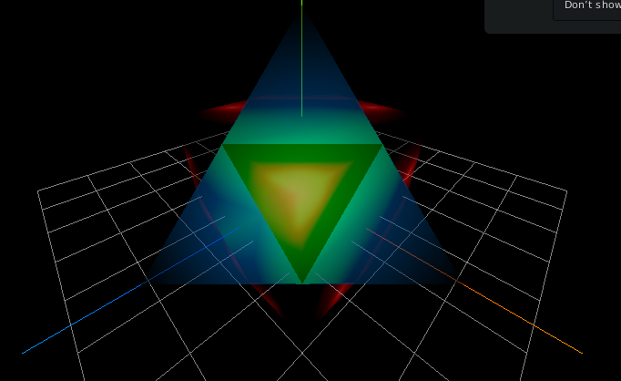
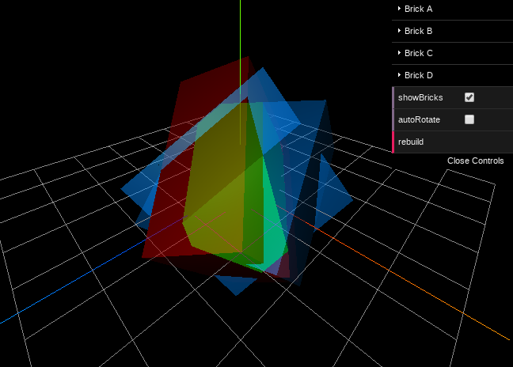
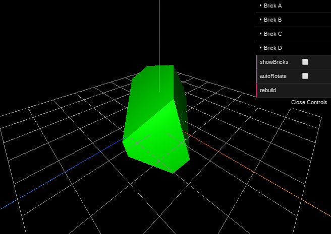

# magnetite-crystal

This is a small magnetite crystal construction simulation (using CSG/constructive solid geometry).

Many thanks to Kathie L. Thomas-Keprta for the magnetite crystal habit analysis:
   http://www.pnas.org/content/98/5/2164/F1.expansion.html

Find a live demo here: http://www.int2byte.de/public/magnetite-crystal