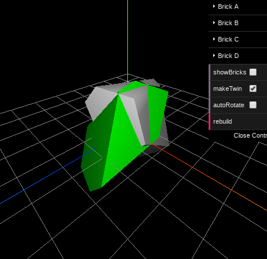
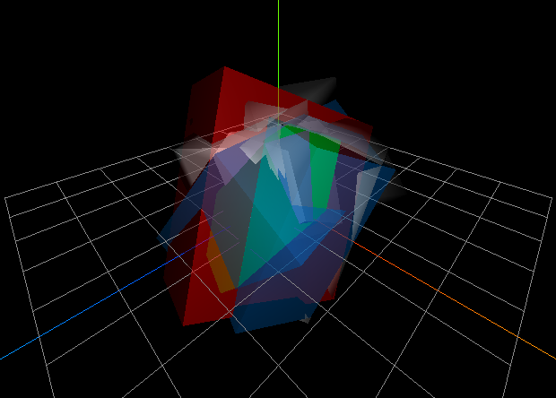
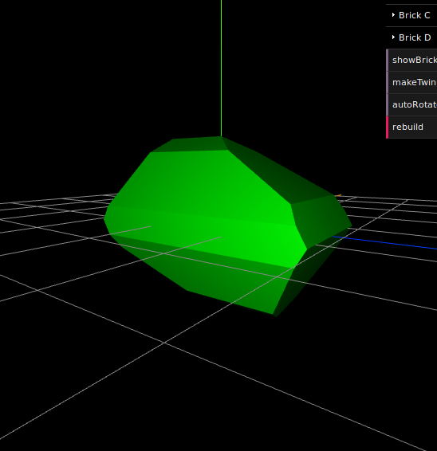
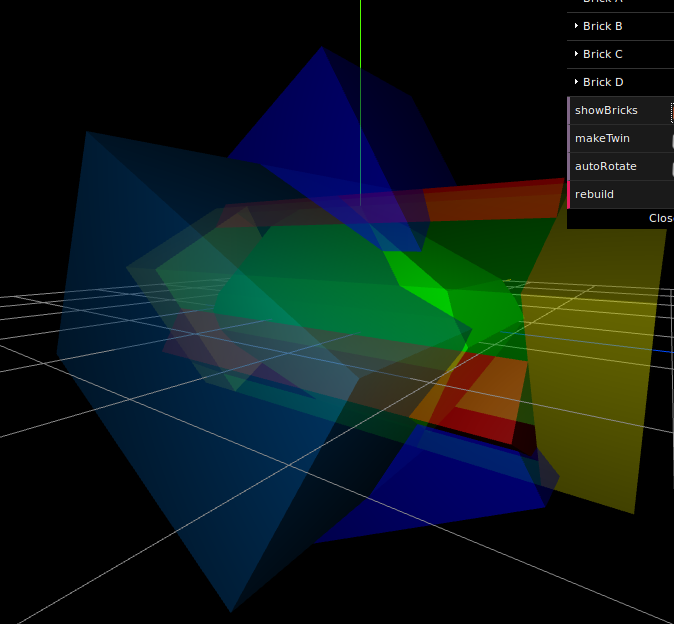
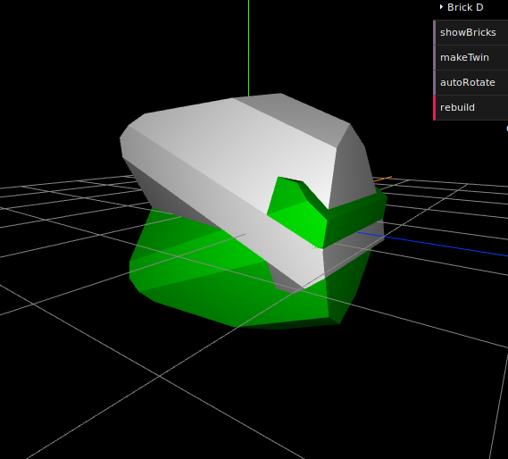

# magnetite-crystal

This is a small magnetite crystal construction simulation (using CSG/constructive solid geometry).

The first four images show failures :)

This is the result after fixing some angles and adding a fourth brick (four
intersected cuboids should build up an octahedron):

Many thanks to Kathie L. Thomas-Keprta for the magnetite crystal habit analysis:
   http://www.pnas.org/content/98/5/2164/F1.expansion.html

Find a live demo here: http://www.int2byte.de/public/magnetite-crystal

To-Do
-----
* Make the translation configurable (values are not applied at the moment).